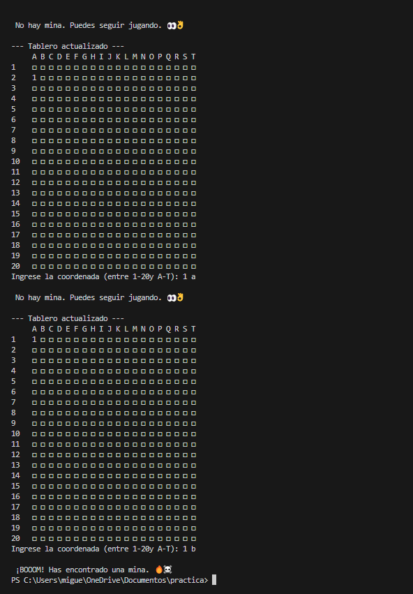

# Buscaminas
# Proyecto de programación sobre el desarrollo de un Buscaminas 

---
#### Integrantes del grupo

* Juan Esteban Arias Lozano
C.C 1011095584
juariaslo@unal.edu.co
* Miguel Angel Moreno Alvarez
C.C 1072423634
migmorenoal@unal.edu.co
* Santiago Aldemar Aguilar Riveros
C.C 1031651244
saaguilar@unal.edu.co
---
## Definición de la Alternativa

### 📌 Objetivo
El proyecto tiene como objetivo el desarrollo de un Buscaminas, este debe consistir de una interfaz simple y facil de entender, debe implemenatar a si mismo una lógica de juego correcta y  desarrollar una versión completamente funcional.

### 📌 Objetivo del avance
El avance del proyecto tiene como objetivo principal asegurar un desarrollo estructurado y eficiente, comenzando con una planeación detallada que establece los pasos necesarios para alcanzar la meta propuesta. Actualmente, se ha trabajado en la creación de la interfaz y la implementación de las funciones básicas, priorizando un diseño intuitivo y funcional que facilite la experiencia del usuario. Durante el desarrollo, se han identificado diversos obstáculos y dificultades, tales como la integración de ciertos componentes, los cuales requieren un enfoque más profundo para garantizar la funcionalidad del sistema.

---

<table cellspacing="1" bgcolor="">
	<tr bgcolor="#252582">
		<th><b>Buscaminas: ¿Qué es un Buscaminas?</b></th>
	</tr>
	<tr bgcolor="#e4e4ed">
		<td style="color:#141414"> 
      Buscaminas es un género de videojuegos de lógica. El videojuego presenta una cuadrícula de casillas en las que se puede hacer clic, donde hay «minas» ocultas esparcidas por todo el tablero.  
      El objetivo es limpiar el tablero sin detonar ninguna mina, con la ayuda de pistas sobre el número de minas vecinas en las casillas circundantes..  
      

        
      

    </td>
  </tr>
</table>

## Diagrama Preliminar

Para describir el proceso y facilitar el desarrollo del algoritmo se optó por realizar un diagra de flujo que resume el funcionamiento básico del juego, desde el inicio, determinar si se gana o pierde, o el resultado de una casilla vacía. 

### 📌 2. Mecánica de Juego

El Buscaminas es un juego de lógica en el que debes descubrir todas las casillas vacías de un tablero sin detonar ninguna mina.

Mecánica de juego:
- Tablero y casillas: Se presenta una cuadrícula con casillas ocultas, algunas de las cuales contienen minas.

— Creamos el tablero con una matriz, con la posibilidad de modificar el rango del tablero

— Añadimos Un random para minas aleatorias en la matriz

- Clic inicial: Al hacer clic en una casilla, puede ocurrir una de tres cosas:
  	— Para ejecución en consola teníamos dos opciones
		*Una posición y desplazarnos por el tablero
		*Coordenadas para ubicar las posiciones

- Si es una mina, pierdes la partida.
- Si es un número, indica cuántas minas hay en las casillas adyacentes.
- Si está vacía, revela un área de casillas vacías cercanas.
- Estrategia y lógica: Usando los números revelados, debes deducir dónde están las minas y marcarlas con banderas.
- Victoria: Ganas si descubres todas las casillas sin minas.

### 📌 3. Posibles Desafíos

Lógica para la expansión de casillas vacías al hacer clic.
Gestión de eventos y actualizaciones gráficas en la interfaz.
Validación de condiciones de victoria y derrota
Programacion del Temporizador
Conteo de puntaje

### ¿Como se abordo la solucion de crear un buscaminas en python?
Partimos desde el hecho de que el funcionamiento de un buscaminas se relaciona con las matrices en python; para jugar un buscaminas es necesario tener una tablero de bloques que forman filas y columnas, ahí es donde se encuentran las minas. 

  
  

Entonces se diseño un programa en python que fuera el equivalente a jugar un buscaminas, para detallar el avance del proyecto es necesario ver el programa en un interprete de python. A continuacion se muestra el resultado ( hasta el momento ) del programa ejecutado en consola.
 

