# Buscaminas
# Proyecto de programación sobre el desarrollo de un Buscaminas 

---
#### Integrantes del grupo

* Juan Esteban Arias Lozano
C.C 1011095584
juariaslo@unal.edu.co
* Miguel Angel Moreno Alvarez
C.C 1072423634
migmorenoal@unal.edu.co
* Santiago Aldemar Aguilar Riveros
C.C 1031651244
saaguilar@unal.edu.co
---

### 📌 Objetivo
El proyecto tiene como objetivo el desarrollo de un Buscaminas, este debe consistr de una interfaz simple y facil de entender, debe implemenatar a si mismo una lógica de juego correcta y  desarrollar una versión completamente funcional.

### 📌 Objetivo del avance
Demostrar el progreso que se ha tenido en el desarrollo del juego, así como los mayores problemas presentados

---

<table cellspacing="1" bgcolor="">
	<tr bgcolor="#252582">
		<th><b>Buscaminas: ¿Qué es un Buscaminas?</b></th>
	</tr>
	<tr bgcolor="#e4e4ed">
		<td style="color:#141414"> 
      Buscaminas es un género de videojuegos de lógica. El videojuego presenta una cuadrícula de casillas en las que se puede hacer clic, donde hay «minas» ocultas esparcidas por todo el tablero.  
      El objetivo es limpiar el tablero sin detonar ninguna mina, con la ayuda de pistas sobre el número de minas vecinas en las casillas circundantes..  
      

        
      

    </td>
  </tr>
</table>

### ¿Como se abordo la solucion de crear un buscaminas en python?
Partimos desde el hecho de que el funcionamiento de un buscaminas se relaciona con las matrices en python; para jugar un buscaminas es necesario tener una tablero de bloques que forman filas y columnas, ahí es donde se encuentran las minas. 

  
  

Para facilitar la creación del juego se elaboró un diagrama con la proceso basico del buscaminas

```mermaid
flowchart TD
    n1["Leer Rango"] --> n2["Leer Numero de minas"]
    n2 --> A["Generar Matriz de tablero"]
    A --> B("Colocar minas aleatoriamente")
    B --> n3["Descubir casilla"]
    n3 --> C{"¿Es una mina?"}
    C -- No --> n4["Mostrar numero de minas vecinas"]
    C -- Si --> n5["Perdiste"]
    n6["¿Hay casillas libres?"] -- No --> n10["Ganaste"]
    n11(["Inicio"]) --> n1
    n10 --> n12["¿Volver a jugar?"]
    n5 --> n12
    n6 --> n3
    n4 --> n6
    n12 -- Si --> n1
    n12 -- No --> n13(["Fin"])
    n1@{ shape: lean-r}
    n2@{ shape: lean-r}

```

