# Buscaminas
# Proyecto de programación sobre el desarrollo de un Buscaminas 

---
#### Integrantes del grupo

* Juan Esteban Arias Lozano

* Miguel Angel Moreno Alvarez

* Santiago Aldemar Aguilar Riveros

# Definición de la Alternativa


## 📌 Objetivo
El proyecto tiene como objetivo el desarrollo de un Buscaminas, este debe consistir de una interfaz simple y facil de entender, debe implemenatar a si mismo una lógica de juego correcta y  desarrollar una versión completamente funcional.

---

<table cellspacing="1" bgcolor="">
	<tr bgcolor="#252582">
		<th><b>Buscaminas: ¿Qué es un Buscaminas?</b></th>
	</tr>
	<tr bgcolor="#e4e4ed">
		<td style="color:#141414"> 
      Buscaminas es un género de videojuegos de lógica. El videojuego presenta una cuadrícula de casillas en las que se puede hacer clic, donde hay «minas» ocultas esparcidas por todo el tablero. <br>
      El objetivo es limpiar el tablero sin detonar ninguna mina, con la ayuda de pistas sobre el número de minas vecinas en las casillas circundantes..<br><br>
      <p align="center">
        
      </p>
    </td>
  </tr>
</table>

## 📌 Diagrama preliminar

Para describir el proceso y facilitar el desarrollo del algoritmo se optó por realizar un diagrama de flujo que resume el funcionamiento básico del juego, desde el inicio, determinar si se gana o pierde, o el resultado de una casilla vacía. 

```mermaid
flowchart TD
    n1["Leer Rango"] --> n2["Leer Numero de minas"]
    n2 --> A["Generar Matriz de tablero"]
    A --> B("Colocar minas aleatoriamente")
    B --> n3["Descubir casilla"]
    n3 --> C{"¿Es una mina?"}
    C -- No --> n4["Mostrar numero de minas vecinas"]
    C -- Si --> n5["Perdiste"]
    n6["¿Hay casillas libres?"] -- No --> n10["Ganaste"]
    n11(["Inicio"]) --> n1
    n10 --> n12["¿Volver a jugar?"]
    n5 --> n12
    n6 --> n3
    n4 --> n6
    n12 -- Si --> n1
    n12 -- No --> n13(["Fin"])
    n1@{ shape: lean-r}
    n2@{ shape: lean-r}

```

<details><summary>Diagrama de flujo </summary><p>


</p></details><br>

<!--
## 📌 2. Mecánica de Juego

El Buscaminas es un juego de lógica en el que debes descubrir todas las casillas vacías de un tablero sin detonar ninguna mina.


<details><summary>Tablero y casillas: Se presenta una cuadrícula con casillas ocultas, algunas de las cuales contienen minas.</summary><p>

* Creamos el tablero con una matriz, con la posibilidad de modificar el rango del tablero

  


* Añadimos Un random para minas aleatorias en la matriz


</p></details><br>
<details><summary>Iniciar partida: primer casilla </summary><p>

— Para ejecución en consola se tenían dos opciones

  * Inciar en una posición y desplazarnos por el tablero
  * Coordenadas para ubicar las posiciones


</p></details><br>

<details><summary>Descubrir casilla: Al hacer clic en una casilla, puede ocurrir una de dos cosas:</summary><p>

* ###  Casilla vacía, indica cuántas minas hay en las casillas adyacentes.


* ###  Mina, pierdes la partida.


</p></details><br>

▶ Estrategia y lógica: Usando los números revelados, debes deducir dónde están las minas y marcarlas con banderas.

▶ Victoria: Ganas si descubres todas las casillas sin minas.

-->

## 📌¿Como se abordo la solucion de crear un buscaminas en python?

### 1. Análisis del Problema
Primero, se identificaron los requisitos básicos del juego de Buscaminas:

* **Tablero:** Un tablero de tamaño variable con casillas que pueden contener minas o números que indican el numero de minas adyacentes.

* **Minas:** Un número determinado de minas ubicadas de manera aleatoria en el tablero.

* **Interacción del Usuario:** El jugador debe poder seleccionar casillas para despejarlas o marcarlas como minas.

* **Victoria/Derrota:** El jugador gana si despeja todas las casillas sin minas y pierde si selecciona una casilla con mina.

* **Puntuación:** Un sistema de puntuación basado en el tiempo y el número de minas.

### 2. Diseño de la Solución
**Estructura del tablero**
Partimos desde el hecho de que el funcionamiento de un buscaminas se relaciona con las matrices en python; para jugar un buscaminas es necesario tener una tablero de bloques que forman filas y columnas, ahí es donde se encuentran las minas. 

<p align="center">
  
  
  <!--  -->
</p>


La base del codigo consiste en crear una matriz base a las minas asignamos el valor 1 y las casillas vacias 0

```
    def generar_tablero(tamano, minas):
    # Se crea una matriz de ceros los cuales son las posiciones seguras 
    matriz = [[0] * tamano for m in range(tamano)]

    # este if es en caso de que las minas sean mayores que el tamaño de la matriz 
    if minas > tamano * tamano:
        return "Error: La cantidad de minas es mayor que el tamaño del tablero."

    # Con esta linea de codigo se generan aleatoriamente las posiciones de los 1 
    indices = np.random.choice(tamano * tamano, minas, replace=False)

    # Colocar las minas en la matriz
    for p in indices:
        fila = p // tamano  # Determinar la fila
        columna = p % tamano  # Determinar la columna
        matriz[fila][columna] = 1

    return matriz  # Devolvemos la matriz con las minas
```

Para la ubicación de minas se utilizó el modulo `random`

```
ejemplo aqui
```

**Interfaz de Usuario**
* Se diseñó una interfaz de texto para la consola.

* Se utilizaron coordenadas (letras para columnas y números para filas) para que el usuario seleccione casillas.

Esta funcion `tablerito` imprime la interfaz del juego  para que  se vea acorde a un sistema de coordenadas. 

```
    def tablerito(columnas, matriz):
      print("     ", end="") 
     for i in range(65, 65 + columnas):  # Cambié 73 por 65 + columnas para que se ajuste al tamaño
        print(chr(i), end=" ")
    print()

    for i in range(1, columnas + 1):
        if i > 9:
            print(i, end="   ")
        else:
            print(i, end="    ")
        for j in range(columnas):
            if matriz[i - 1][j] == 1:
                print("1", end=" ")  # Representa una mina
            else:
                print("□", end=" ")  # Representa un espacio vacío
        print()
    return tablerito
```

* Se implementó un sistema para marcar casillas como minas usando el formato M A1.

  

Lógica del Juego
* Se implementó una función recursiva (despejar_casilla) para despejar casillas vacías y sus adyacentes automáticamente.

* Se verificó si el jugador ganó al despejar todas las casillas sin minas.

* Se manejó la condición de derrota cuando el jugador selecciona una casilla con mina.

Para contar las minas adyacentes usamos la siguiente función

```
def contar_minas_alrededor(matriz, fila, columna):
    #Cuenta el número de minas alrededor de una posición dada.
    filas = len(matriz)
    columnas = len(matriz[0])
    minas_cerca = 0

    # Recorrer las posiciones vecinas
    for i in range(max(0, fila - 1), min(filas, fila + 2)):
        for j in range(max(0, columna - 1), min(columnas, columna + 2)):
            if (i, j) != (fila, columna) and matriz[i][j] == 1:
                minas_cerca += 1
    return minas_cerca
```
Para hacer las actualizaciones del tablero se utiliza la siguiente funcion basada en la de la interafz del juego:

```
    def mostrar_tablero_actualizado(matriz, fila, columna):
# Tiene la misma estructura de la funcion tablerito, es para ordenar la matriz 
    filas = len(matriz)
    columnas = len(matriz[0])
    print("\n--- Tablero actualizado ---")
    print("     ", end="")
    for i in range(65, 65 + columnas):  # Cambié 73 por 65 + columnas para que se ajuste al tamaño
        print(chr(i), end=" ")
    print()
	 for x in range(filas):
	        if x >= 9:
	            print(x + 1, end="   ")
	        else:
	            print(x + 1 , end="    ")
	        for y in range(columnas):
	            if x == fila and y == columna:
	                minas_cerca = contar_minas_alrededor(matriz, fila, columna)
	                print(minas_cerca, end=" ")
	            else:
	                print("□", end=" ")
	        print()

```

Posteriormente se utiliza una función que evalua dato ingresado, verificando si es un digito o no:

```
	def es_numero(valor):
	        for caracter in valor:
	            if caracter < '0' or caracter > '9':
	             return False
	        return True
```

Para hacer el filtro de ingreso de datos y estar seguros de que las coordenadas ingresadas son correctas se usa esta funcion:

```
def verificar_coordenada(matriz):
    filas = len(matriz)
    columnas = len(matriz[0])

    while True:
        # Pedir la coordenada en un solo input
        entrada = input("Ingrese la coordenada (entre 1-" + str(filas) + "y A-" + chr(64 + columnas) + "): ").upper()

        # Separar la entrada en fila y columna
        partes = entrada.split()
        if len(partes) != 2:
            print("Formato incorrecto. Debe ser 'fila columna'. Intenta nuevamente.")
            continue

        fila_txt, columna_txt = partes

        # Verificar la fila
        if es_numero(fila_txt) == False:
            print("Fila no es un número válido, intenta nuevamente.")
            continue

        fila = int(fila_txt) - 1
        if fila < 0 or fila >= filas:
            print("Fila fuera de rango, intenta nuevamente.")
            continue

        # Verificar la columna
        if len(columna_txt) != 1 or not ('A' <= columna_txt <= chr(64 + columnas)):
            print("Columna fuera de rango, intenta nuevamente.")
            continue

        columna = ord(columna_txt) - 65  # Convertir la letra a índice de columna

        # Verificar si hay una mina en la posición
        if matriz[fila][columna] == 1:
            print("\n ¡BOOOM! Has encontrado una mina. 🔥☠️")
            return False  # Fin del juego
        else:
            print("\n No hay mina. Puedes seguir jugando. 👀👌")
            mostrar_tablero_actualizado(matriz, fila, columna)
            return True  # Continuar jugando
```

Al final se imprime la interfaz y se llaman las funciones

```
print("------------------------------------------")
print("--BIENVENIDO AL  BUSCAMINAS STRAVAGANTE--")
print("------------------------------------------")
tamano = int(input("--Tamaño del tablero: "))  # Pedimos al usuario el tamaño y la cantidad de minas
minas = int(input("--Cantidad de minas: "))
print("------------------------------------------")

# Generamos el tablero y mostramos el resultado
matriz = generar_tablero(tamano, minas)
tablerito(tamano, matriz)
print("Las minas colocadas son =", minas)
```

Este bucle hace que el proceso se repita hasta que el jugador ingrese una mina=

```
# Bucle principal del juego
while True:
    if verificar_coordenada(matriz) == False:
        break  # Fin del juego si se encuentra una mina
```

### 3. Implementación
El código se construyó en Python utilizando algunas de las siguientes herramientas y técnicas:

* **Módulos:**

`import random`
<details><summary> Para la generación aleatoria de minas.</summary><p>

Se usa `random.sample` para seleccionar posiciones aleatorias en el tablero donde se colocarán las minas.
```
indices = random.sample(range(tamano * tamano), minas)
```

Aquí, `random.sample` elige minas números únicos de un rango de 0 a tamano * tamano - 1, que representan las posiciones de las minas.

</p></details><br>

`import os` 
<details><summary> Para limpiar la consola y mejorar la experiencia del usuario.</summary><p>

El módulo `os` proporciona funciones para interactuar con el sistema operativo. En este código, se usa principalmente para limpiar la consola y mejorar la experiencia del usuario.

```
os.system('cls' if os.name == 'nt' else 'clear')
```

`os.name` Devuelve el nombre del sistema operativo ('nt' para Windows)

`cls` Comando para limpiar la consola en Windows.
</p></details><br>

`import time` 
<details><summary>Para medir el tiempo transcurrido y calcular la puntuación. </summary><p>

Se usa `time` para trabajar con funciones relacionadas con el tiempo. En este código, se usa para medir el tiempo transcurrido durante el juego y calcular la puntuación.

* Medición del tiempo: En la función `jugar`, se usa `time.time()` para obtener el tiempo actual en segundos.
```
inicio_tiempo = time.time()
```
Luego, se calcula el tiempo transcurrido restando el tiempo inicial del tiempo actual:

```
tiempo_transcurrido = int(time.time() - inicio_tiempo)
```
Este valor se usa para reducir la puntuación del jugador a medida que pasa el tiempo.
</p></details><br>

* **Funciones principales:**

`generar_tablero` Para crear el tablero con minas y números.

`mostrar_tablero` Para mostrar el tablero en la consola.

`despejar_casilla` Para despejar casillas y sus adyacentes.

`jugar` Función principal que maneja la lógica del juego.


### 5. Resultado Final
El resultado fue un juego de Buscaminas funcional y entretenido, implementado completamente en Python. El juego incluye:

* Tableros personalizables.
* Un sistema de puntuación dinámico.
* Una interfaz de usuario intuitiva.
* Condiciones claras de victoria y derrota.


